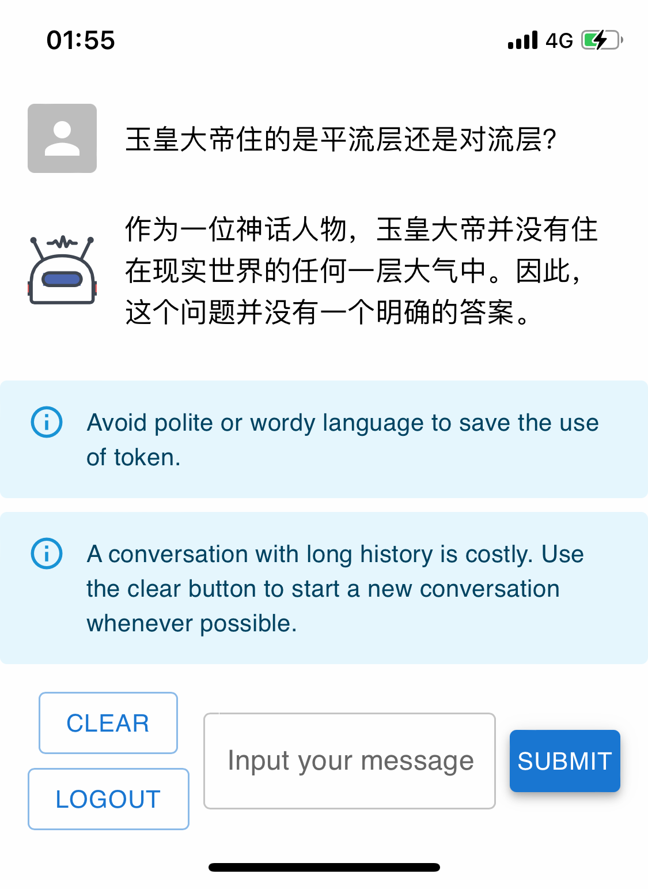

# chatgpt-api-web

Access OpenAI's GPT model in a web page.

Your API key is configured in a server. Password is needed before invoking the API.

## Screenshot



## Deploy

```bash
git clone https://github.com/chatgpt-api-web/chatgpt-api-web-docker.git
cd chatgpt-api-web-docker/
git submodule update --init --recursive
# Specify your `OPENAI_KEY` in docker-compose.yml file.
nano docker-compose.yml
docker-compose build
docker-compose pull
docker-compose up -d
```